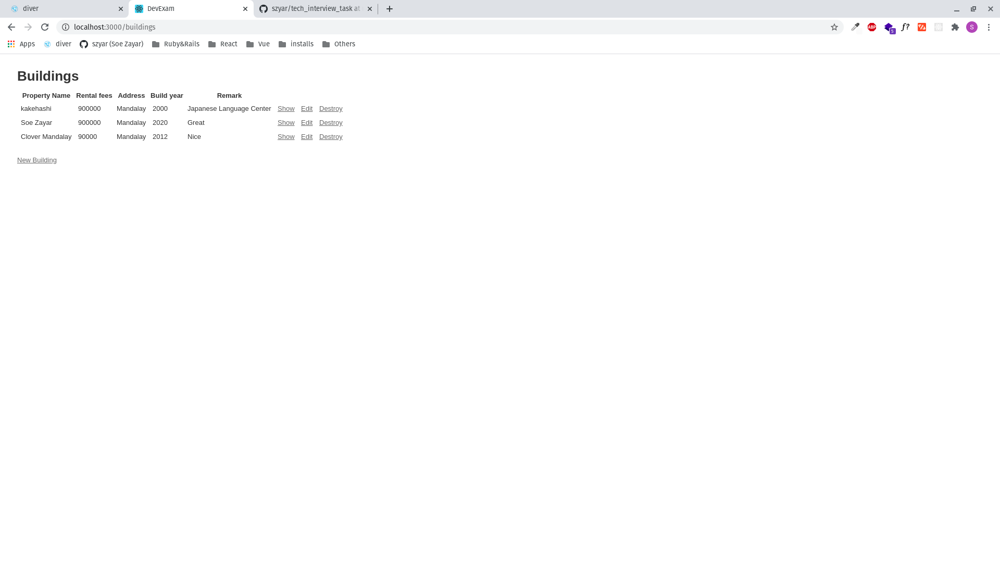
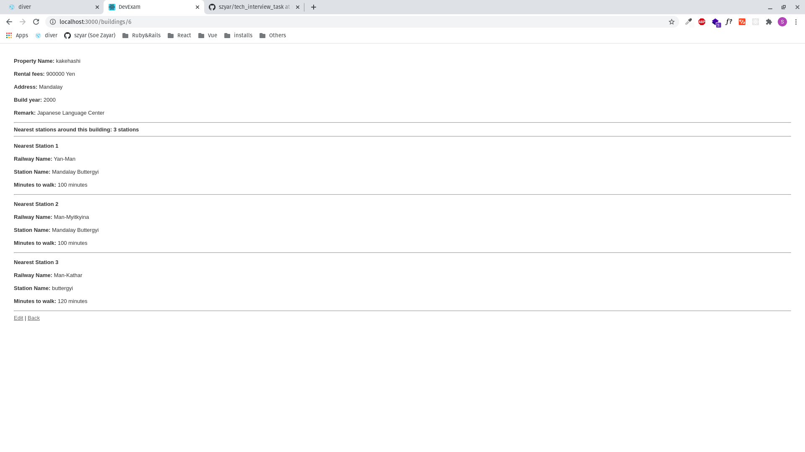
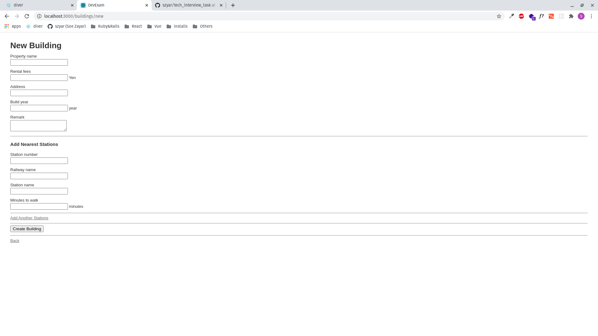
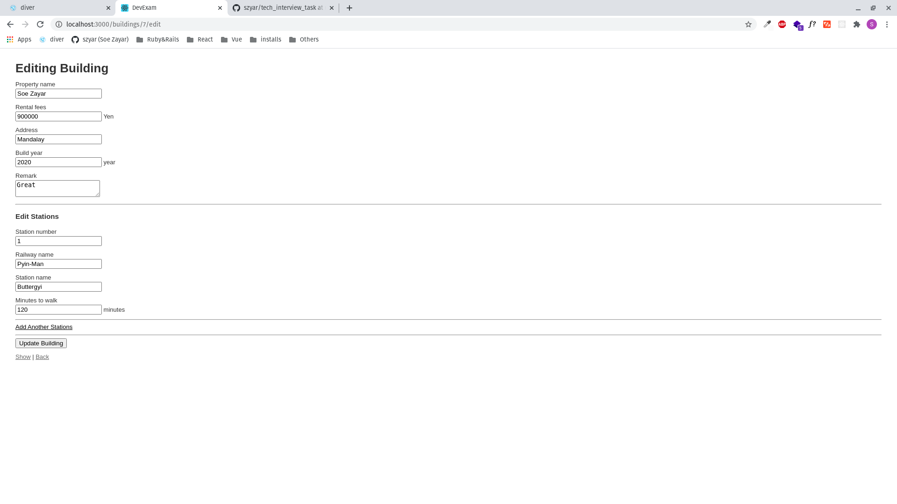

このリポジトリは、技術力テスト用のリポジトリです。

## 開発するアプリケーションの概要
賃貸情報物件情報画面のCRUDを実装お願い致します。既にrails newしただけのアプリケーションのソースコードがありますので、その上に実装してください。

Ruby on Railsに慣れている方であれば1〜2時間程度で出来るボリュームと見積もっております。

## 開発環境
### 言語・ミドルウェア
diver に掲載のテキストに書かれているものを使うこととします。

詳細はそちらを参照ください。

### 仕様
- 賃貸情報物件情報画面のCRUDのキャプチャをファイル添付します。キャプチャの通り実装をお願いします。
- 最寄り駅情報は数を増やす可能性がありますので、考慮した実装をお願い致します。
- テストコードの実装は不要です

#### 一覧

#### 閲覧

#### 登録

#### 編集

## 注意事項
### 質疑について
仕様に関する質疑は着手前・後一度だけ応対可能です。必要な事項はまとめてご質問ください。

### スケジュール
テスト開始から1週間程度

### リポジトリ運用について
課題を始める際は、まずこのリポジトリをcloneして、ご自身のアカウント内にリポジトリを作成してください(publicで問題ありません)。このとき**必ずリポジトリ名を適当な名称に変更**しておいてください(例: rat-giraffe)。

新しいブランチを作り、その上で作業を行い、ご自身のリポジトリにpull requestを出してください(clone元にpull requestを出さないように注意ください)。
